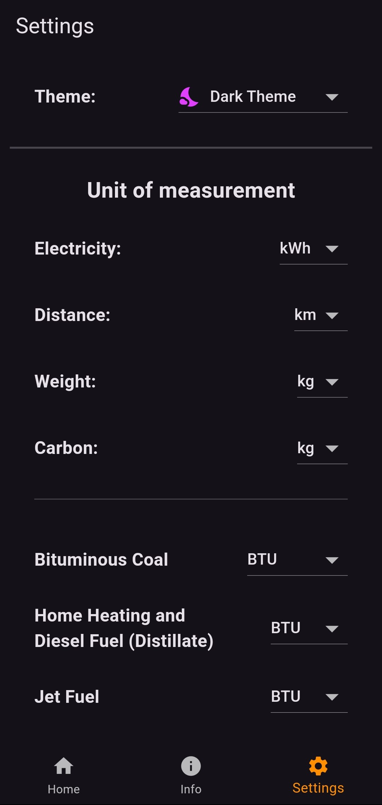
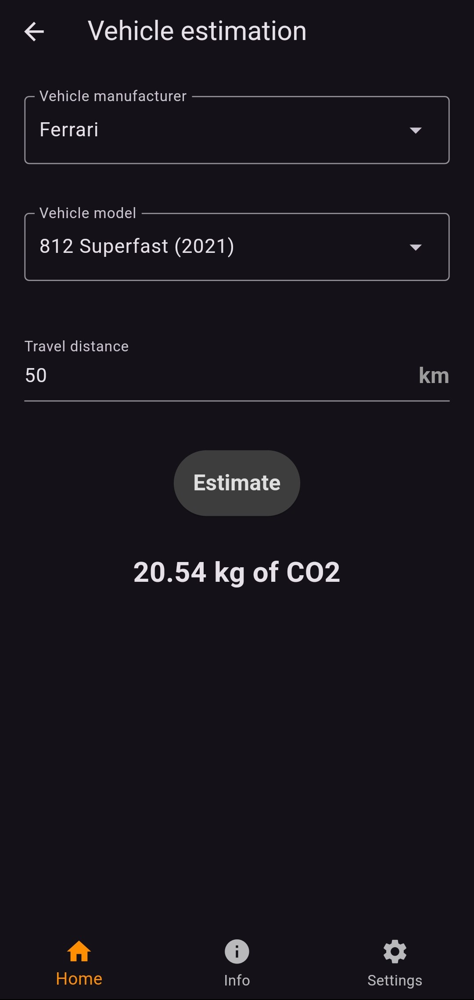

# Impakt

Impakt is a mobile application that allows users to estimate carbon emissions, based on the APIs provided by [Carbon Interface](https://www.carboninterface.com/).

Specifically, it allows for estimates in five categories:  
- **Electricity:** Estimates the carbon emissions of the power generation mix in the specified country or state.
- **Flight:** Estimates carbon emissions based on the number of passengers and the distance between airports.
- **Shipping:** Estimates the carbon emissions generated from shipping goods between two locations.
- **Vehicle travel:** Estimates carbon emissions from operating more than 42,000 different vehicle models.
- **Fuel combustion:** Estimates carbon emissions from the static combustion of over 12 fuel sources, measured in both volume and BTU.

## Screenshots
<p align="center">
	
	
	
</p>

## Local Installation

You can install the APK for Android devices directly from [releases](https://github.com/Gabritorre/impakt/releases) to try it out (it has a limited number of shared API calls per month).

Alternatively, you can build the APK yourself by following these steps:

1. Install Flutter (see [Flutter installation guide](https://docs.flutter.dev/get-started/install)).
2. Obtain an API key from [Carbon Interface](https://www.carboninterface.com/).
3. Create the file `assets\.env` and add the key in the following format:
	```text
	API_KEY=<your_key>
	```
4. Navigate to the project's root directory in the command line.
5. Run `flutter pub get` to install dependencies.
6. Run `flutter build apk` to generate the APK.
